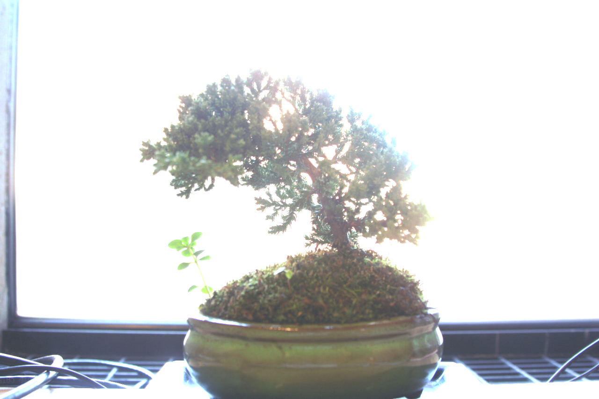
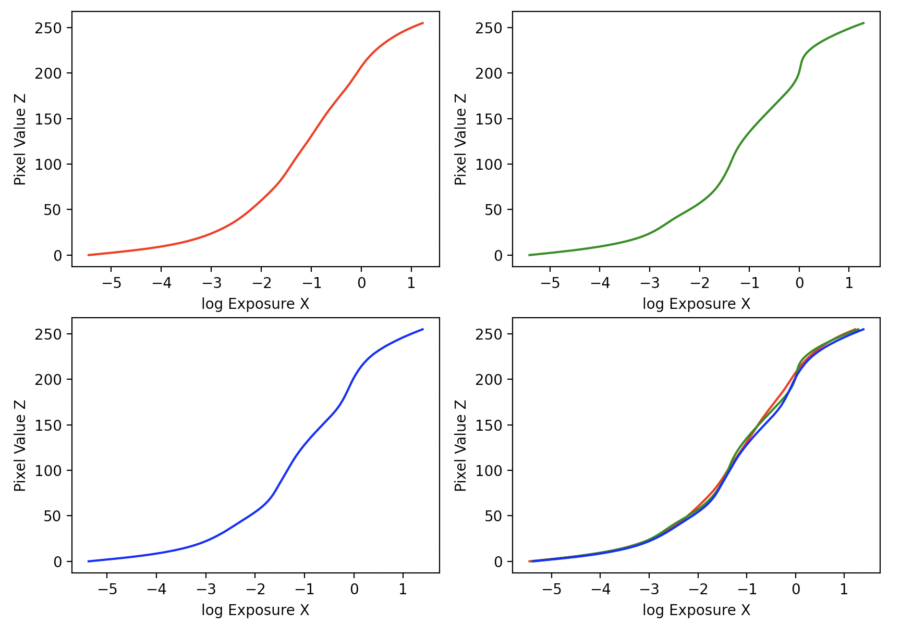

# CS 180: Final Project

# Project 1: High Dynamic Range

## Overview

Modern cameras are unable to capture the full dynamic range of commonly encountered real-world scenes. In some scenes, even the best possible photograph will be partially under or over-exposed. Researchers and photographers commonly get around this limitation by combining information from multiple exposures of the same scene, but in this project, I wrote code to automatically combine multiple exposures of the same scene and convert this radiance map to an image suitable for viewing through tone mapping. This project closely follows [Debecek and Malik 1997](https://www.pauldebevec.com/Research/HDR/debevec-siggraph97.pdf) and [Durand 2002](https://people.csail.mit.edu/fredo/PUBLI/Siggraph2002/DurandBilateral.pdf).

## 1. Radiance Map Construction

The input images are digitized photographs taken from the same vantage point with different known exposure durations Δtj. In HDR imaging, the observed pixel value, 𝑍𝑖𝑗, for a specific pixel 𝑖 in an image 𝑗, is derived from the scene's radiance 𝐸𝑖 and the exposure time Δ𝑡𝑗. The radiance at pixel 𝑖 integrated over the exposure time gives us the exposure value at that pixel. Typically, the relationship between pixel value and exposure is represented by a complex pixel response function 𝑓, but instead of directly solving for 𝑓, we can reformulate the equation to solve for 𝑔 instead, which is ln(𝑓−1), which maps pixel values (ranging from 0 to 255) to the logarithm of exposure values: 𝑔(𝑍𝑖𝑗)=ln(𝐸𝑖)+ln(Δ𝑡𝑗).

In this equation, 𝑍𝑖𝑗 and Δ𝑡𝑗 are knowns while 𝑔 and 𝐸𝑖 are unknowns. We do know that the scene remains unchanged across the image sequence, which allows us to assume that 𝐸𝑖 is constant for each pixel across images.

In the `solve_g(Z, B, l, w)` function, we return 𝑔, the log exposure corresponding to pixel value z (where z is between 0 - 255), and lE, the log film irradiance at each pixel location 𝑖. I used least squares to solve for g and L, using the known values of 𝑍𝑖𝑗, also taking into account weighting of pixel contributions becuase pixels that are too dark or too bright may be heavily influenced by noise or saturation. Additionally, we have to ensure the smoothness of 𝑔 by incorporating a constraint based on its second derivative.

Here are example plots of g_red, g_green, g_blue, and all of them combined (log exposure vs. pixel value):

After solving for g, I used function `hdr(file_names, g_red, g_green, g_blue, w, exposure_matrix, nr_exposures)`, which takes in the exposure stack image filenames, response function g for all three color channels, the weighting function value, exposure matrix, and number of images / exposures to return the HDR radiance map. We follow the following equation from Durand 2002.

After writing these two functions, we can successfully obtain HDR radiance maps for input images. Below is an example of the HDR image on an HDR radiance map (mean of channels) and HDR radiance map on the arch.

| HDR Radiance Map (mean of channels) | HDR Radiance Map |
|:----------------------------------------|:---------------------|
|  | |

## 2. Tone Mapping

After obtaining the radiance map, I can convert it into a displayable image using tone-mapping. I first implemented a simple global tone-mapping operator and stretched the intensity values in the resulting image for maximum contrast. The global tone-mapping operator I used was L / (L + 1). 

I then implemented a local method following the Durand paper for a more effective tone-mapping method. These were the following steps:
1. Your input is linear RGB values of radiance.
2. Compute the intensity (I) by averaging the color channels.
3. Compute the chrominance channels: (R/I, G/I, B/I)
4. Compute the log intensity: L = log2(I)
5. Filter that with a bilateral filter: B = bf(L)
6. Compute the detail layer: D = L - B
7. Apply an offset and a scale to the base: B' = (B - o) * s
8. Reconstruct the log intensity: O = 2^(B' + D)
9. Put back the colors: R',G',B' = O * (R/I, G/I, B/I)
10. Apply gamma compression so that the result doesn't look too dark. I used a gamma value of 0.5

These were my Durand results (as well as some in-between steps: the bilateral filtered image & details) for the original set of arch images:

| Bilateral Filtered Image | High-Frequency Details |
|:----------------------------------------|:---------------------|
|  | |

| Global Scale | Global Simple | Durand |
|:----------------------------------------|:---------------------|:---------------------|
|  | | |

Here are more results for other sets of images (bonsai, chapel, garage):

**Example 1: Bonsai!**

| HDR Radiance Map (mean of channels) | HDR Radiance Map |
|:----------------------------------------|:---------------------|
|  | |

Tone Mapping

| Bilateral Filtered Image | High-Frequency Details |
|:----------------------------------------|:---------------------|
|  | |

| Global Scale | Global Simple | Durand |
|:----------------------------------------|:---------------------|:---------------------|
|  | | |

**Example 2: Chapel**

| HDR Radiance Map (mean of channels) | HDR Radiance Map |
|:----------------------------------------|:---------------------|
|  | |

Tone Mapping

| Bilateral Filtered Image | High-Frequency Details |
|:----------------------------------------|:---------------------|
|  | |

| Global Scale | Global Simple | Durand |
|:----------------------------------------|:---------------------|:---------------------|
|  | | |

**Example 3: Garage**

| HDR Radiance Map (mean of channels) | HDR Radiance Map |
|:----------------------------------------|:---------------------|
|  | |

Tone Mapping

| Bilateral Filtered Image | High-Frequency Details |
|:----------------------------------------|:---------------------|
|  | |

| Global Scale | Global Simple | Durand |
|:----------------------------------------|:---------------------|:---------------------|
|  | | |

## Bells & Whistles

I implemented this algorithm on my own images! 

Here are the original images of varying exposures (from high to low), as well as the resulting images:

    

| HDR Radiance Map (mean of channels) | HDR Radiance Map |
|:----------------------------------------|:---------------------|
|  | |

Tone Mapping

| Bilateral Filtered Image | High-Frequency Details |
|:----------------------------------------|:---------------------|
|  | |

| Global Scale | Global Simple | Durand |
|:----------------------------------------|:---------------------|:---------------------|
|  | | |

I wanted to try HDR on an image with people, and the Durand algorithm still ended up looking pretty good! Like the other images, the Durand's tone mapped image comes out a bit washed out with slightly duller colors, but it is still a lot better representation of the image, especially in comparison to the global simple tone mapping. In my opinion, out of all the examples, this result was one of the better ones!

# Project 2: Light Field Camera - Depth Refocusing and Aperture Adjustment with Light Field Data

## Overview

Shown in the paper [Light Field Photography with a Hand-held Plenoptic Camera](https://graphics.stanford.edu/papers/lfcamera/lfcamera-150dpi.pdf) by Professor Ren Ng, capturing multiple images over a plane orthogonal to the optical axis enables achieving complex effects using very simple operations like shifting and averaging, and we can reproduce some of these effects using lightfield data from the [Stanford Light Field Archive](http://lightfield.stanford.edu/lfs.html), and the images displayed here are from the Amethyst rectified and cropped images. 

## 1. Depth Refocusing

In the first part of this project, I simulated a camera focusing at different depths using all the grid images. Objects that are far away from the camera don't change in position significantly when the camera moves around, but nearby objects vary their position significantly. If we simply average all the images in the grid without shifting, the image will be blurry around nearby objects and sharp around far-away objects. We thus shift the images "appropriately" -- I wrote a shift function with the signature function `shift_images(data, C, mid, order)`.

In this function, each image is converted from BGR to RGB color space to align with typical color processing standards. A spatial shift is calculated for each image based on its distance from the midpoint, scaled by the coefficient. This shift effectively mimics camera or object movement, allowing the viewer to refocus on different planes within the scene based on the shifted perspective.
I used the scipy.ndimage.shift function to apply the calculated shift to the image.

I then shifted all the images and averaged them.

Some examples of the camera focusing at different depths:

      

I made a GIF of this image with the camera changing depths.

## 2. Aperture Adjustment

In order to simulate a camera of different apertures focusing on a common point, I adjusted my `shift_images(data, C, mid, order)` to include an aperture component `shift_images(data, ap, C, mid, order)`, 

The logic I added was adding to the for loop - for each image in the dataset, only images whose coordinates are within the defined aperture distance from the midpoint are considered for shifting. It calculates the horizontal and vertical distances (x_shift and y_shift) from the image's coordinates to the specified midpoint, which simulates the effect of an optical aperture, which limits the field of view to a specific region around the midpoint.

Examples of the camera focusing on a common point at different apertures (lower to higher):

     

Here is a GIF of the same image with increasing apertures:

## Summary

Throughout this project, I gained a deeper understanding of lightfield technology, which can enable people to capture visual information across multiple dimensions, unlike traditional photography. I thought the paper, written by Ren Ng et al. (professor at UC Berkeley!) was really cool and showed how capturing multiple images across a plane orthogonal to the optical axis can lead to powerful post-capture manipulations.

For depth refocusing, I learned how the position of objects relative to the camera's movement affects their apparent position in captured images. Objects further from the camera show little positional change, while closer objects exhibit significant shifts, and for the aperture adjustment, I appreciated how light field technology can replicate and extend traditional camera settings post-capture.

Overall, I appreciated learning more about the flexibility of light field cameras, which provide the ability to adjust focus and aperture settings post-capture, which opens up new possibilities for photographers and researchers, including in the fields of virtual reality, augmented reality, and advanced imaging systems.
